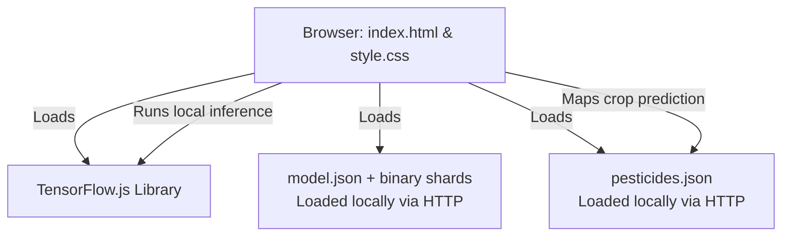

# Crop Buddy - Codebase Context (Pure TensorFlow.js & Static Vercel)

This document provides a comprehensive overview of the **Crop Buddy** application, its architecture, data models, file structures, and setup instructions. The application runs purely client-side without any Python or Node.js server dependencies during runtime, making it fully ready for Vercel deployment.

---

## 1. Project Overview
**Crop Buddy** is an AI-powered agricultural helper system. It allows farmers and researchers to upload photos of crop leaves (covering 14 species of plants including Apple, Blueberry, Cherry, Corn, Grape, Orange, Peach, Pepper, Potato, Raspberry, Soybean, Squash, Strawberry, and Tomato) directly in their browser to diagnose **38 different healthy/diseased states** and receive bilingual (Gujarati & English) treatment instructions, pesticide names, and fungicide application guidelines.

---

## 2. Architecture & Tech Stack

The application uses a **fully client-side static architecture**:



1. **Frontend (Client-side HTML/CSS/JS)**:
   - [index.html](file:///C:/Users/Aryan/OneDrive/Desktop/cropbuddy/index.html): The main web page. Contains the UI layouts, embeds TensorFlow.js via CDN, handles image uploads, and performs tensor-based image resizing and normalization before running local inference.
   - [style.css](file:///C:/Users/Aryan/OneDrive/Desktop/cropbuddy/style.css): Vanilla CSS containing typography, layout styles, and responsive visual treatments.

2. **Model Files (TensorFlow.js Web Model)**:
   - [model/model.json](file:///C:/Users/Aryan/OneDrive/Desktop/cropbuddy/model/model.json) & binary shards: Converted from a pre-trained **Harimitra PlantVillage Model**. It defines the model architecture (Input shape: `[None, 128, 128, 3]`) and points to 8 weight shards (`group1-shard1of8.bin` to `group1-shard8of8.bin`), which are loaded into the browser dynamically.

3. **Pesticides Database**:
   - [pesticides.json](file:///C:/Users/Aryan/OneDrive/Desktop/cropbuddy/pesticides.json): Standalone static JSON dataset containing pesticide details, modern insecticides, specialized treatments, and fungicide instructions in English and Gujarati.

4. **Local Static Test Server (Node.js/Express)**:
   - [server.js](file:///C:/Users/Aryan/OneDrive/Desktop/cropbuddy/server.js): A lightweight development server. It serves static assets from the root directory to resolve browser CORS blocks when loading the model and database JSON files locally.

---

## 3. Directory Structure

```
C:\Users\Aryan\OneDrive\Desktop\cropbuddy\
├── model/                         # TensorFlow.js model files
│   ├── model.json                 # Model architecture configuration (128x128 shape)
│   └── group1-shard1of8.bin to 8  # Model weight binary shards (loaded on-demand)
├── node_modules/                  # Express package for local development
├── 1.jpeg to 15.jpeg              # Sample test leaf images
├── index.html                     # Frontend user interface and client-side AI engine
├── pesticides.json                # Standalone database containing pesticide recommendations
├── server.js                      # Static file server (express) for local development
├── style.css                      # Application styling stylesheet
├── package.json                   # Express dependency & start script for local dev
├── package-lock.json              # Node.js lockfile
├── context.md                     # Current file (Codebase context documentation)
├── plan.md                        # The migration plan used to convert to TFJS
├── crop_disease_model.h5          # Pre-trained Keras model (94MB - source backup)
├── crop_model.keras               # Original 4-class Keras model (backup)
├── CROPBUDDY REPORT.pdf           # Project documentation (PDF format)
└── vercel.json                    # Vercel static routing configuration
```

---

## 4. Key Client-Side Implementation Details

### Preprocessing & Inference (`index.html`)
The image is loaded into an `HTMLImageElement` preview, then preprocessed in the browser using the WebGL/WASM backend:
```javascript
const predictions = tf.tidy(() => {
    // 1. Convert image element to a tensor
    let tensor = tf.browser.fromPixels(imgElement);
    
    // 2. Resize to 128x128 (required by Harimitra MobileNet topology)
    tensor = tf.image.resizeBilinear(tensor, [128, 128]);
    
    // 3. Normalization: (pixel - 127.5) / 127.5
    const offset = tf.scalar(127.5);
    const normalized = tensor.sub(offset).div(offset);
    
    // 4. Add batch dimension [1, 128, 128, 3]
    const batched = normalized.expandDims(0);
    
    // 5. Predict
    const prediction = model.predict(batched);
    return prediction.arraySync()[0]; 
});
```

---

## 5. How to Run Locally

Since TensorFlow.js needs to fetch the `model.json` and binary weight shards dynamically, the files must be served by a web server (browsers block loading dynamic JSON files via `file://` protocols due to security policies).

1. Install local developer dependencies (only `express`):
   ```bash
   npm install
   ```
2. Start the local server:
   ```bash
   npm start
   ```
3. Open your browser and navigate to:
   ```
   http://localhost:3000
   ```

---

## 6. How to Deploy to Vercel

Vercel will build this project as a **Zero-Config Static Web Application**:
1. Connect your git repository to Vercel.
2. Vercel automatically detects `index.html` as the default homepage.
3. No build steps or custom commands are needed. The app runs fully serverless and client-side on the edge.
