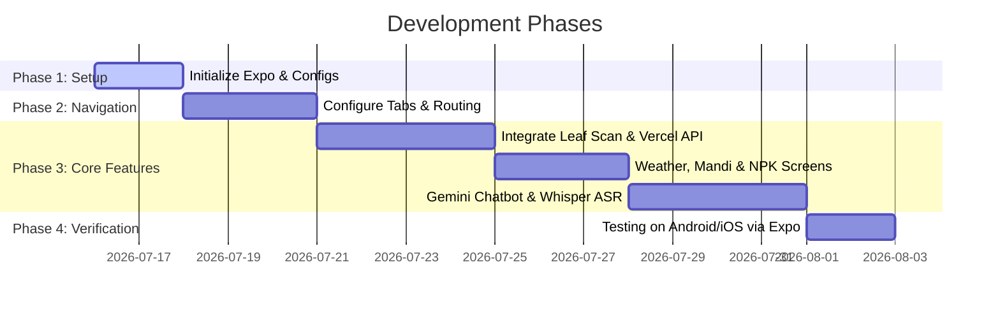

# 📱 CropBuddy React Native Expo Mobile App Plan

This document outlines the architecture and phase-wise plan to build a brand new React Native Expo Go application inside the `mobile_version` folder, utilizing the active Vercel API endpoints for predictions and chatbot services.

---

## 1. Goal Description
To build a clean, cross-platform Android and iOS application using **Expo Go** that matches the feature set of the CropBuddy web app. 
*   **Inference & AI**: The mobile app will outsource all prediction and voice recognition tasks to your existing, serverless Vercel endpoints (e.g. `/api/predict_custom`, `/api/chat`, and `/api/asr`), ensuring minimal mobile package size and high speed.
*   **Location**: `mobile_version` will reside as a clean, separate directory in the root.

---

## 2. Technical Stack Suggestion

*   **Framework**: Expo SDK 51+ (React Native) with TypeScript.
*   **Navigation**: Expo Router (file-based navigation with tabs).
*   **Styling**: React Native StyleSheet with custom HSL-green tokens matching CropBuddy's brand identity.
*   **Libraries**:
    *   `expo-camera` / `expo-image-picker` (for leaf scans and gallery backups).
    *   `expo-location` (for hyper-local weather advisory).
    *   `expo-av` (for voice recordings sent to the speech API).
    *   `axios` (for robust API networking to Vercel).

---

## 3. Phase-wise Implementation Plan



### 🗓️ Phase 1: Initialize Project Structure
1. Run `npx -y create-expo-app@latest mobile_version --template tabs`.
2. Configure `app.json` (app name, bundle identifiers, and permissions for camera, micro, location).
3. Setup environmental variables in `.env` to point to the production Vercel deployment:
   ```text
   EXPO_PUBLIC_API_URL=https://cropbuddy-rho.vercel.app
   ```

### 🗓️ Phase 2: Navigation & Branding
1. Set up a bottom-tab navigation containing:
   *   `index` (Home dashboard).
   *   `analyze` (Leaf disease scanner & bottle scanner).
   *   `weather` (Spray safety weather advisor).
   *   `chat` (AI chatbot voice-enabled).
   *   `tools` (Mandi prices & NPK calculators).
2. Apply the HSL-Green design system (Vibrant forest green `#1b4332`, soft green `#f4fbf7`).

### 🗓️ Phase 3: Core Feature Integrations
1.  **Leaf Disease Scanner**:
    *   Use `expo-image-picker` to capture or choose photos.
    *   Convert the photo to a base64 string on the device.
    *   Send the base64 string via a `POST` request to `https://cropbuddy-rho.vercel.app/api/predict_custom`.
    *   Display predictions, confidence, and corresponding database remedies.
2.  **Weather Advisor**:
    *   Request permission using `expo-location`.
    *   Fetch current latitude/longitude, query Open-Meteo, and compute safe wind/temp spray conditions.
3.  **AI Chatbot & Voice (Whisper ASR)**:
    *   Implement chat interface with history.
    *   Use `expo-av` to record audio bytes, base64 encode them, and POST to the Vercel Whisper ASR API `/api/asr`.
    *   Send output text to the Gemini endpoint `/api/chat`.

### 🗓️ Phase 4: Testing & Verification
*   Launch Metro Bundler on Mac: `npx expo start`.
*   Scan QR code using **Expo Go** app on Android and iOS devices.
*   Validate all endpoints.

---

## 4. Verification Plan

### Manual Verification Checklist
- [.] App launches successfully in Expo Go on iOS & Android.
- [.] Camera opens, takes photo, and displays successful Vercel disease response.
- [.] Location is fetched, and weather advice is calculated.
- [.] Microphone records audio, sends to ASR, and outputs Gemini chatbot response.
