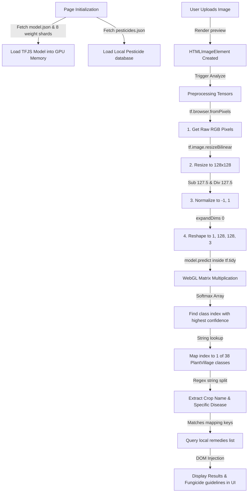

# Crop Buddy - AI Model & Prediction Pipeline Documentation

This document explains the machine learning model source, dataset origins, links, and the step-by-step prediction process used in **Crop Buddy**.

---

## 1. Model & Dataset Information

### A. Pre-trained Model Source
*   **Repository Hub**: Hugging Face
*   **Model Repository**: [sudhir75/Harimitra](https://huggingface.co/sudhir75/Harimitra)
*   **Format**: Keras H5 (converted to TensorFlow.js Layers format)
*   **Direct Download Links**:
    *   Original H5 Model File: [trained_model.h5](https://huggingface.co/sudhir75/Harimitra/resolve/main/trained_model.h5)
    *   Original Keras Model File: [trained_model.keras](https://huggingface.co/sudhir75/Harimitra/resolve/main/trained_model.keras)

### B. Training Dataset Source
*   **Dataset Name**: New Plant Diseases Dataset (PlantVillage)
*   **Hosted Platform**: Kaggle
*   **Direct Link**: [New Plant Diseases Dataset on Kaggle](https://www.kaggle.com/datasets/vipoooool/new-plant-diseases-dataset)
*   **Dataset Size**: ~87,900 images of healthy and diseased crop leaves.
*   **Classification Reach**: 38 distinct crop-disease combinations across 14 plant species (Apple, Blueberry, Cherry, Corn, Grape, Orange, Peach, Pepper Bell, Potato, Raspberry, Soybean, Squash, Strawberry, and Tomato).

---

## 2. Prediction Architecture & Client-Side Inference Pipeline

By removing all backend servers, Crop Buddy performs **100% of its machine learning calculations locally** in the user's browser. This is done using **TensorFlow.js** via a compiled WebGL/WASM hardware accelerator.

### Step 1: Initialization & Asset Loading
1. The client browser fetches `pesticides.json` (the bilingual remedy database).
2. The browser requests [model/model.json](file:///C:/Users/Aryan/OneDrive/Desktop/cropbuddy/model/model.json), which serves as the map of the network layers.
3. The browser automatically streams the 8 binary weight shards (`group1-shard1of8.bin` to `group1-shard8of8.bin`) in parallel. Once downloaded, these weights are loaded directly into graphics memory (VRAM).

### Step 2: Image Preprocessing
When an image is submitted, it is loaded into an `HTMLImageElement` and prepared using the following pipeline inside **[index.html](file:///C:/Users/Aryan/OneDrive/Desktop/cropbuddy/index.html)**:
1.  **Pixel Conversion**: The image pixels are converted to a 3D float tensor `[Height, Width, Channels]` using `tf.browser.fromPixels()`.
2.  **Resizing**: The tensor is resized to **`128x128` pixels** using bilinear interpolation (`tf.image.resizeBilinear()`) to match the input layer expectations of the Harimitra architecture.
3.  **Rescaling/Normalization**: The raw `0-255` pixel values are scaled to the range `[-1, 1]` to match training conditions:
    $$normalized = \frac{pixel - 127.5}{127.5}$$
4.  **Batch Dimension Expansion**: Tensors are expanded to a 4D shape `[1, 128, 128, 3]` using `expandDims(0)` to represent a batch size of 1.

### Step 3: Inference Execution
The 4D tensor is sent to `model.predict()`. This runs the weights calculations locally on the user's GPU.
*   The entire execution runs inside **`tf.tidy()`** which immediately cleans up all intermediate tensors from graphics memory once the calculations complete, preventing browser tab crashes due to memory leaks.
*   The prediction returns a 1D array of 38 floats representing probabilities. The class with the highest probability value (index derived via an argmax loop) is chosen.

### Step 4: Post-Processing & String Parsing
The predicted class string is parsed using a regex split (`"___"`):
*   *Example*: `"Tomato___Early_blight"` is split into:
    *   **Plant Name**: `"Tomato"`
    *   **Condition Name**: `"Early blight"`

### Step 5: Pesticide & Treatment Mapping
The frontend matches the parsed plant name and condition to entries in [pesticides.json](file:///C:/Users/Aryan/OneDrive/Desktop/cropbuddy/pesticides.json):
*   **Healthy Condition**: No treatments are loaded, and the UI displays a healthy state confirmation.
*   **Bacterial Disease** (e.g. *Bacterial Spot*): Maps to `specializedTreatments.bactericides` (Streptocycline, Agrimycin).
*   **Spider Mites**: Maps to `commonPesticides[1].subCategories[2]` (Red Spider Mite specific miticides like Dicofol, Aramite).
*   **Yellow Leaf Curl Virus**: Since whiteflies are the vector, it maps to `commonPesticides[1].subCategories[1]` (Whitefly control pesticides like Triazophos, Acephate).
*   **Mosaic Virus**: Maps to `commonPesticides[1].subCategories[0]` (Sucking pest vector controls).
*   **Fungal Infections** (e.g., *Early Blight, Late Blight, Leaf Mold, Rusts, Scab, Rots*): Lists the relevant crop-specific fungicides alongside the global bilingual **Fungicide Guidelines** (containing details on Copper Oxychloride, drip line fungicides, and Sulfur guidelines in Gujarati and English).
