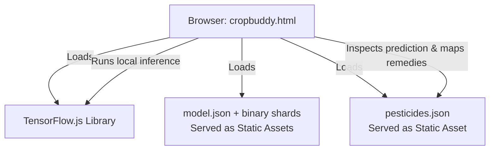

# Migration Plan: Pure TensorFlow.js & Serverless/Static Vercel Deployment

This document outlines the step-by-step strategy to **remove the Python backend dependency** from Crop Buddy. By porting the machine learning inference directly to the browser (client-side) using **TensorFlow.js**, we can simplify the architecture and host the entire application on **Vercel** for free as a static web application.

---

## 1. Target Architecture Comparison

### Current Architecture (Three-Tier)
* **Frontend**: HTML/CSS/JS (`cropbuddy.html`)
* **Gateway**: Node.js/Express (`server.js`) on Port 3000
* **Inference**: Python Flask (`cropbuddy.py`) on Port 5000 + `tensorflow`/`tf_keras`
* **Hosting**: Requires running virtual machines / persistent servers.

### Proposed Architecture (Pure Static / Client-Side)
* **Frontend**: Single-Page App (`cropbuddy.html`) + TensorFlow.js (via CDN/npm)
* **Inference**: **Browser-side** using `@tensorflow/tfjs` (loads model directly from Vercel CDN)
* **Database**: Local static JSON file (`pesticides.json`) fetched on load.
* **Hosting**: **Vercel Static Hosting** (Zero backend servers, zero hosting costs, near-instant load speeds).



---

## 2. Why Client-Side TF.js is Superior to Vercel Serverless Functions

While we could run TensorFlow.js in Vercel Serverless Functions (Node.js), client-side browser inference is highly recommended for this project:
1. **Avoids Size Limits**: Vercel Serverless Functions have a strict size limit of 50MB (hobby tier). Node.js bindings for TensorFlow (`@tensorflow/tfjs-node`) combined with the 25MB model file will easily exceed this threshold.
2. **Eliminates Cold Starts**: Loading a 25MB model into memory on serverless function wakeups introduces significant latency (5-10+ seconds). Client-side caching keeps the model cached in the user's browser.
3. **No Execution Costs**: Inference happens on the client's device, bypassing Vercel execution limits or CPU/memory costs.
4. **Improved Privacy & Bandwidth**: Plant photos do not need to be uploaded to any server, offering faster response times and offline capability.

---

## 3. Step-by-Step Migration Plan

### Step 3.1: One-Time Model Conversion (Python Local)
Before removing the local Python environment, we must convert `crop_model.keras` into the TensorFlow.js web-friendly format (`model.json` + binary weight shards).

1. Install the conversion utility in the active Python environment:
   ```bash
   pip install tensorflowjs
   ```
2. Convert the model to a layered Web Model directory:
   ```bash
   tensorflowjs_converter --input_format=keras crop_model.keras ./public/model
   ```
   *Note: This will produce a `model.json` file and several `.bin` shard files (usually 4MB each) in the output directory.*

### Step 3.2: Export Database to Static JSON
We need to extract the `cropBuddyPesticideData` dictionary from `server.js` and save it as a standalone static JSON file for the client to read.
1. Create `public/pesticides.json` (or just `pesticides.json`).
2. Copy the exact dictionary structure from `server.js` into this file.

### Step 3.3: Rewrite Frontend Inference (`cropbuddy.html` / `cropbuddy.js`)
We will replace the AJAX network call (`fetch('http://localhost:3000/api/analyze')`) with local TensorFlow.js code.

1. **Load TF.js via CDN** (add to `<head>`):
   ```html
   <script src="https://cdn.jsdelivr.net/npm/@tensorflow/tfjs@4.20.0/dist/tf.min.js"></script>
   ```
2. **Load Model & Database on Page Init**:
   ```javascript
   let model;
   let pesticideData;
   
   async function initializeApp() {
       // Load TensorFlow.js Model
       model = await tf.loadLayersModel('./public/model/model.json');
       // Load Pesticide recommendations
       const res = await fetch('./pesticides.json');
       pesticideData = await res.json();
   }
   window.addEventListener('DOMContentLoaded', initializeApp);
   ```
3. **Replicate Preprocessing & Inference**:
   ```javascript
   async function runInference(imageElement) {
       // 1. Convert image element to a tensor
       const tensor = tf.browser.fromPixels(imageElement)
           .resizeNearestNeighbor([224, 224]) // Resize
           .toFloat();
           
       // 2. Normalize to [-1, 1] range (same as python: (img / 127.5) - 1.0)
       const offset = tf.scalar(127.5);
       const normalized = tensor.sub(offset).div(offset);
       const batched = normalized.expandDims(0);
       
       // 3. Run prediction
       const prediction = model.predict(batched);
       const scores = await prediction.data();
       
       // 4. Map to classes: ["corn", "cotton", "potato", "tomato"]
       const classes = ["corn", "cotton", "potato", "tomato"];
       const maxIdx = prediction.argMax(1).dataSync()[0];
       const confidence = (scores[maxIdx] * 100).toFixed(2);
       const crop = classes[maxIdx];
       
       // Clean up tensors from memory
       tensor.dispose();
       normalized.dispose();
       batched.dispose();
       prediction.dispose();
       
       return { crop, confidence };
   }
   ```
4. **Map Results Local to Frontend**:
   Update the submission button click event to:
   - Convert the uploaded image file to an `HTMLImageElement` preview.
   - Pass it to `runInference()`.
   - Read recommendations directly from the loaded `pesticideData` object matching the predicted crop.
   - Render the details directly into the DOM (no backend calls needed).

### Step 3.4: Cleanup Python and Node Server Files
Once client-side execution is confirmed working:
1. Delete Python files: `cropbuddy.py`, `cropbuddy.js` (legacy Flask), and the `.venv/` folder.
2. Delete Node files: `server.js`, `package.json`, `package-lock.json`, and `node_modules/`.
3. Keep only:
   - `cropbuddy.html` (main entrypoint)
   - `style.css` (styles)
   - `pesticides.json` (dataset)
   - `public/model/` (converted model files)
   - Sample images and report documents.

---

## 4. Vercel Deployment Steps

Deploying a static web app to Vercel is extremely straightforward:
1. Initialize git (if not already initialized) and commit the files.
2. Run `vercel` in the command line (or link the repo to the Vercel GitHub integration dashboard).
3. Vercel will automatically discover the static files, serve `cropbuddy.html` as the index document, and serve the model shards with optimized headers.
4. No specialized runtime settings or API route configurations are required.
